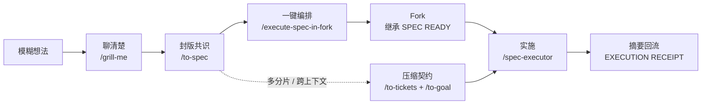

# Matt Skills with To-Goal — 使用教程

> 本教程面向首次接触本仓库的用户：读完即可独立安装、初始化项目，并跑通「想法 → Spec → 执行 → 回执」的完整流程。
> 配套资源：[README.md](./README.md)（项目总览）、在线故事版 <https://verifiable-goal-weekly-share-public.pages.dev>。

---

## 1. 这是什么项目

**Matt Skills with To-Goal** 是 [mattpocock/skills](https://github.com/mattpocock/skills)（Matt Pocock 的 AI 编码技能集）的一个 fork，当前版本 **`1.2.3-to-goal.2`**（上游 `main` v1.2.3，同步至 2026-08-10，commit `84fdeff`）。

它是一套 **Agent Skills**（斜杠命令 + 行为规范），供 Claude Code、Codex 等 AI 编码工具加载，把「从模糊想法到代码落地」组织成一条可重复的工程工作流。

**它解决的核心问题**：AI 对话线程越长，上下文越容易膨胀、压缩、变慢；直接开新线程又怕丢失已确认的需求。本仓库用「两类线程 + 仓库里的持久化证据」来解决：

- **规划线程**：负责把需求聊清楚，停在已封版的 `SPEC READY`；
- **执行线程**：Fork 出来或携带 Goal 契约，专心实现、测试、评审，并回传结构化收据。

> **一句话原则：能继承就 Fork（隔离后续上下文），要搬运就 Goal（压缩已有上下文）。**
> 连续开发优先 fork；跨人、跨天、跨引擎、并行或上下文混乱时使用 `to-goal`。

### 与上游的差异（fork 的增值点）

| 差异 | 说明 |
|---|---|
| 新增 5 个 Skill | `to-goal`、`goal-crafter`、`spec-executor`、`execute-spec-in-fork`、`roundtable`（均在 `skills/engineering/`） |
| 自动 Fork 闭环 | Codex App 中一键把 `SPEC READY` fork 成执行任务、自动运行 executor、回传 receipt、条件归档 |
| 可验证 Goal 交接 | `to-tickets` 之后多一步 `to-goal`，把已规划任务编译成新线程可直接执行的契约 |
| 独立发行身份 | 插件名 `matt-skills-with-to-goal`，与上游 `mattpocock-skills` 互不覆盖 |

---

## 2. 仓库结构速览

```
matt-skills-with-to-goal/
├── skills/                      # 所有技能，按桶(bucket)分类
│   ├── engineering/             # 日常编码工作（promoted，随插件发行）
│   ├── productivity/            # 日常非编码工作流（promoted，随插件发行）
│   ├── misc/                    # 保留但少用（不进插件）
│   ├── in-progress/             # 公测通道（不进插件）
│   └── deprecated/              # 已弃用
├── .claude-plugin/plugin.json   # Claude Code 插件清单（= 全部 promoted skills）
├── docs/                        # 人类可读文档
│   ├── engineering/  ├── productivity/   # 每个 promoted skill 对应一页
│   └── maintaining-fork.md      # 维护者手册（同步/发布）
├── .agents/                     # ADR、安装块、写作/调用规范
├── .changeset/                  # changeset 版本管理
├── scripts/                     # 维护脚本（lint/sync）
├── AGENTS.md → CLAUDE.md        # 本仓库给 agent 看的约定
├── CONTEXT.md                   # 领域词汇表
├── CHANGELOG.md
└── README.md
```

**每个 Skill 的形态**：`skills/<bucket>/<skill-name>/` 目录里一个 `SKILL.md`（行为规范主体），Claude Code 侧用 frontmatter 的 `disable-model-invocation` 标记调用方式，Codex 侧由同目录的 `agents/openai.yaml` 提供界面元数据与 `allow_implicit_invocation`。同一套技能双 harness 共用。

### 调用方式：用户触发 vs 模型触发

| 类型 | 谁能触发 | 例子 |
|---|---|---|
| **User-invoked**（用户触发） | 只有人类显式输入 | `/ask-matt`、`/to-spec`、`/to-goal`、`/grill-me`、`/roundtable` … |
| **Model-invoked**（模型触发） | 模型或用户 | `/spec-executor`、`/goal-crafter`、`/tdd`、`/code-review`、`/grilling` … |

模型触发的 skill 会「在任务合适时被模型自动想起」；用户触发的 skill 只有你打出来才会执行（防止模型自作主张）。下文命令均以 Claude Code 的 `/name` 形式书写；在 Codex 等 harness 中按显式提及/选择器调用。

**完整分类（30 个 promoted skills）**：

| 触发方式 | 全部技能 |
|---|---|
| 🔒 **用户触发（16 个）**——必须你亲手调用 | `/ask-matt`、`/grill-me`、`/grill-with-docs`、`/wayfinder`、`/roundtable`、`/to-spec`、`/to-tickets`、`/to-goal`、`/implement`、`/triage`、`/improve-codebase-architecture`、`/setup-matt-pocock-skills`、`/handoff`、`/teach`、`/to-questionnaire`、`/wait-what` |
| ⚡ **模型触发（14 个）**——任务合适时模型自动调用，你也可手动输入 | `/spec-executor`、`/execute-spec-in-fork`、`/goal-crafter`、`/prototype`、`/research`、`/tdd`、`/code-review`、`/diagnosing-bugs`、`/domain-modeling`、`/codebase-design`、`/resolving-merge-conflicts`、`/wizard`、`/grilling`、`/writing-for-agents` |

规律很好记：**「流程开关」都是用户触发**（聊需求、写 spec、拆票、编 goal、开会、分流……它们决定对话走向、需要你做决策，模型绝不能擅自启动）；**「流程内部零件」都是模型触发**（`/grilling` 访谈引擎、`/tdd`、`/code-review`、`/spec-executor` 等会被外层 skill 或模型在合适的时机自动拉进来）。另外，用户触发的 skill 只能调用模型触发的 skill，永远不能互相调用；模型触发的 skill 你随时可以手动输入——两条路都通。

---

## 3. 安装（三选一）

> ⚠️ 只选一种安装方式，避免同一 Skill 被重复加载。

### 方式 A — Claude Code 插件（推荐，受管只读包）

```bash
claude plugin marketplace add tt-a1i/matt-skills-with-to-goal
claude plugin install matt-skills-with-to-goal@tt-a1i
```

在会话内也可用 `/plugin install matt-skills-with-to-goal@tt-a1i`。

### 方式 B — skills.sh（Codex 及其他支持 Agent Skills 的工具，可编辑副本）

```bash
# 安装全套（首次使用工程工作流务必勾选 setup-matt-pocock-skills）
npx skills@latest add tt-a1i/matt-skills-with-to-goal

# 只装某一个
npx skills@latest add tt-a1i/matt-skills-with-to-goal --skill=<name>
npx skills@latest update <name>          # 更新单个
```

### 方式 C — 维护者本地同步

仅仓库维护者（本机已布好 `~/.agents_skills` 统一架构）使用：

```bash
npm run sync:local     # 备份并同步 30 个 promoted Skills 到 ~/.agents_skills/，并刷新 Hermes
```

### 额外依赖（仅自动 Fork 闭环需要）

Codex App 中的**自动** Fork 闭环还需要单独安装 [Codex Task Messenger](https://github.com/tt-a1i/codex-task-messenger)。没有它仍可手动 Fork 后运行 `/spec-executor`，核心执行能力不受影响。

---

## 4. 每个项目首次使用：初始化

```text
/setup-matt-pocock-skills
```

每个项目第一次使用前运行一次（提示驱动，不是脚本）。它会探索仓库现状、向你确认后写入：

1. **🗂️ Issue tracker**（issue 存在哪里）：GitHub（默认，用 `gh`）/ GitLab（`glab`）/ 本地 markdown（`.scratch/<feature>/`）/ 其他（自由描述）。结果写入 `docs/agents/issue-tracker.md`。
2. **🏷️ Triage 标签**（仅装了 `triage` skill 才问）：默认五角色标签 `needs-triage` / `needs-info` / `ready-for-agent` / `ready-for-human` / `wontfix`。写入 `docs/agents/triage-labels.md`。
3. **📖 Domain docs 布局**：默认单上下文（根 `CONTEXT.md` + `docs/adr/`）；检测到 monorepo 信号才提供多上下文 `CONTEXT-MAP.md`。写入 `docs/agents/domain.md`。

最后把 `## Agent skills` 块写进已有的 `CLAUDE.md` 或 `AGENTS.md`（已存在哪个改哪个，不新建另一个）。

之后的工程技能（`to-spec` / `to-tickets` / `triage` / `to-goal`）都会读这些约定。之后想换 tracker 可重跑，或直接编辑 `docs/agents/*.md`。

---

## 5. 主流程：30 秒看懂



**最短链路（三分钟走完）**：

```text
/grill-me          # 1. 把想法聊清楚
/to-spec           # 2. 产出 agent-ready spec，发布到 tracker，得到 SPEC READY 块
/execute-spec-in-fork   # 3a. Codex App 自动 fork + 执行（或手动 Fork 后跑 /spec-executor）
```

- 若 Spec 无法在一个执行会话完成 → 改走 `/to-tickets` → `/to-goal`。
- 小改动、已清楚、不需要持久 spec → 当前线程直接 `/implement`。

---

## 6. 两种「跨上下文边界」方式：Fork vs Goal

| | **Fork 路线**（`execute-spec-in-fork` + `spec-executor`） | **Goal 路线**（`to-tickets` + `to-goal`） |
|---|---|---|
| 适用 | Spec 能在一个执行会话完成，当前线程一致、干净 | 跨人 / 跨天 / 跨引擎 / 并行；或历史过长、存在多版冲突 |
| 传什么 | Fork 继承整个上下文快照（**继承一切，不压缩**） | 把已批准证据压成一份干净契约（**压缩一切，不继承**） |
| 谁来做 | Codex App 自动建任务、发 Ask、回传收据、验证后归档 | 只生成可粘贴/可执行的 Goal，执行环境由你安排 |
| 需要的工具 | Codex App 原生任务工具 + Codex Task Messenger（否则手动 Fork） | 任何能贴 Goal 文本的引擎（Cursor / Claude Code / Codex…） |
| 产物 | `SPEC EXECUTION RECEIPT` | Goal 契约（含完成标准、约束、上下文） |

> Fork 只隔离对话、不隔离文件系统：并行实现仍需独立 worktree / 分支 / 文件所有权。

---

## 7. 技能地图（30 个 promoted Skills）

> 记不住入口时先 `/ask-matt`，它会按你的处境推荐 skill 或流程。

### 7.1 规划与交接

| Skill | 何时用 |
|---|---|
| `/ask-matt` | 不确定该用哪个 skill 时——它是全技能路由器 |
| `/grill-me` | 不在工作目录里、要纯聊清一个想法/方案/写作（无状态，不留痕） |
| `/grill-with-docs` | 在工作目录里访谈，边聊边沉淀 `CONTEXT.md` 与 ADR（有纸面痕迹，优先用） |
| `/grilling` | 只想要访谈原语本身（模型触发，一般不用直接调） |
| `/wayfinder` | 超大、迷雾式任务（绿地项目/大 feature），一个会话装不下 → 建决策地图逐票推进 |
| `/roundtable` | 决策已成形，想用对立视角的子代理围攻它（见 §8.5） |
| `/to-spec` | 已有共识 → 合成 agent-ready spec 并发布到 tracker，产出 `SPEC READY` |
| `/to-tickets` | spec 太大 → 拆成带依赖（blocking edges）的 tracer-bullet tickets |
| `/to-goal` | frontier ticket → 可粘贴的可验证执行 Goal（见 §8.1） |
| `/goal-crafter` | goal 的可验证性与目标 harness 格式（模型触发，见 §8.2） |
| `/to-questionnaire` | 关键决策在别人脑子里 → 生成问卷交给他填 |
| `/handoff` | 仅在关键上下文尚未沉淀到持久载体、需要跨目录/跨 harness/交接他人时 |

### 7.2 实现与质量


| Skill | 何时用 |
|---|---|
| `/implement` | 同线程按 spec/tickets 实现：驱动 `/tdd`，收尾跑 `/code-review` 后提交 |
| `/execute-spec-in-fork` | Codex App 中自动 Fork、启动 executor、回传收据、条件归档（见 §8.4） |
| `/spec-executor` | 在 fork 线程锁死 `SPEC READY` 实现并输出 receipt（见 §8.3） |
| `/tdd` | 想在预定 seam 上测试驱动地实现具体行为 |
| `/code-review` | 对某段 diff 做 Standards + Spec 双轴评审 |
| `/prototype` | 用一次性代码回答设计问题（状态/逻辑 → 单文件 HTML；UI → 变体探索） |
| `/research` | 派后台 agent 对着高可信一手资料做调研，产出带引用的 md |
| `/triage` | 外来 issue / PR 需要评估分流（只处理不是你创建的工作） |

### 7.3 工程理解与其他

| Skill | 何时用 |
|---|---|
| `/codebase-design` | 讨论/设计模块形态（deep module、seam、adapter 词汇） |
| `/diagnosing-bugs` | 系统化定位复杂 bug（先建能稳定复现的反馈环） |
| `/domain-modeling` | 打磨领域语言：挑战术语、维护 `CONTEXT.md`、记录 ADR |
| `/improve-codebase-architecture` | 找架构深化机会（默认 markdown 报告，可选 HTML） |
| `/resolving-merge-conflicts` | 处理进行中的 merge/rebase 冲突（按意图解决，永不 `--abort`） |
| `/teach` | 多会话教学，把当前目录当有状态学习空间 |
| `/wizard` | 只有人才能做的步骤（开基础设施、配凭证/CI secret、走第三方后台）→ 生成交互式向导脚本 |
| `/wait-what` | 一句话没听懂时，让 agent 用 `CONTEXT.md` 词汇重讲 |
| `/writing-for-agents` | 写 agent 消费的文档（skills、AGENTS.md 等） |

### 7.4 非 promoted 桶（不进插件）

- `misc/`、`in-progress/`、`deprecated/` 下的技能**不随插件发行**，可经 skills.sh 逐个安装试用；`deprecated/` 当前为空。

---

## 8. 本 fork 新增技能的深入用法

### 8.1 `/to-goal` — 把已规划任务编译成执行 Goal

**一句话**：把已批准的 spec / agent-ready ticket / tracker frontier 编译成一份**可验证执行 Goal**，让新会话直接照着执行，不再重新访谈。

- **只读**：不实现、不改 issue 状态、不建分支、不写文件。
- **输入（选一）**：不带参数（读 tracker 选当前未阻塞的 frontier ticket）/ ticket 号或 URL / 父 spec issue / 本地 spec 或 ticket 路径 / `--all <parent>`（跨 ticket 依赖序大 Goal，仅显式要求时用）。
- **本地 tracker 约定**：spec 在 `.scratch/<feature>/spec.md`，ticket 一个文件一个，`issues/<NN>-<slug>.md`。
- **流程**：选 frontier → 读全量证据（spec + ticket + 评论 + 仓库现状）→ 记录实施前 HEAD 作为评审 fixed point → 逐条验收标准分类（已证完成 / 明显未完成 / 未验证；commit message 不算证据）→ 发现验证命令 → 填 Goal 模板 → 附 Session 建议。
- **产出**：可复制的 Goal（Current state / Execution order / Completion criteria / Constraints / Context）+ Session 建议（fresh / persistent、Lightweight | Standard | Advanced、Low | Medium | High，只按风险推荐，不硬编码模型名）。
- **门槛**：源材料缺关键产品决策或完成条件时，报告「source 尚未 agent-ready」并指出缺什么，而不是重新开一轮需求访谈。

> 默认一个 Goal 只覆盖一个 frontier ticket；`--all` 用于明确要求的跨 ticket 持久化执行，且必须警告「需要能续上下文的持久 harness」。

### 8.2 `/goal-crafter` — 可验证 Goal 的语法与格式（模型触发）

**一句话**：一个没有可勾选完成标准的 goal 只是愿望。它保证 agent 能不问人就回答「我做完了吗？」。

- **Standalone 模式**：你直接说「帮我写个 goal / 设置自动化任务」，它按序只问 5 个问题：做什么、在哪跑、**DONE 长什么样（最关键，必须机器可判）**、约束、目标 harness（Claude Code `/goal`、Codex Automations、Pi、generic）。
- **Compiled-handoff 模式**：被 `/to-goal` 内部调用，**不再访谈**，只应用可验证性规则与目标 harness 格式。
- 产出自检四连：能无歧义判 done/not done？每条件可观察无人工判断（禁「看起来不错」）？约束够防 scope creep？上下文够开工不问「在哪/怎么做」？**一个 checkbox 只放一个可验证条件。**

### 8.3 `/spec-executor` — Fork 里的执行者（模型触发）

**一句话**：在 fork/新线程中锁定继承的 `SPEC READY` 契约并实现，最后返回一段 `SPEC EXECUTION RECEIPT` 贴回规划线程。

- **找契约**：最新 `SPEC READY` 块 + 其引用的完整 spec（含评论）；之后用户的更正 > 旧需求；路线说 `to-tickets` 或含未决产品决策 → 停下解释路由问题。
- **开工前发 execution lock**（一句话目标 / Source / In scope / Out of scope / Validation / External authority），并记录真实实施前 HEAD。
- **实现**：逐条验收标准 → 最小 seam；用 `/tdd`；收尾 `/code-review` 对比 fixed point；只做本 spec 范围。
- **授权边界**：调用本 skill ≠ 授权 commit/push/开 PR/改 tracker/部署/写生产数据/花钱调真实服务/打扰真人——这些必须由 spec 或用户后续消息**显式授权**。
- **收据**：`Conclusion`（completed / partially completed / blocked）+ 每条验收标准 pass/fail 与证据 + 改动文件 + 验证结果 + 外部影响 + 风险；离线程前脱敏（凭据/令牌/隐私）。
- **溢出处理**：一个执行上下文装不下 → 不静默丢历史，返回 partial receipt、保留 worktree、建议 `/to-tickets` 拆分或 `/to-goal` 编译剩余切片。

### 8.4 `/execute-spec-in-fork` — Codex App 编排适配器（模型触发）

**一句话**：把一个 `SPEC READY` 编排成同目录 Codex 执行任务：Fork → Ask 子任务跑 `/spec-executor` → 决策经 Codex Task Messenger 回流 → 校验 receipt → 归档。

- **前置**：Codex App 原生任务工具（fork/read/archive 等，具体名字见 SKILL 里的 capability map）+ `/codex-task-messenger` v2+ 的 Ask/Reply/Resume 卡协议。缺任一 → 不模拟传输，直接给手动兜底方案（手动 Fork + `/spec-executor` + 贴回 receipt）。
- **授权信封**：本次调用只授权建同目录 fork、命名发消息、通过 `/spec-executor` 做 in-scope 本地实现与验证、决策未决时 pin 子任务、验证通过后 unpin 并归档。Messenger 卡片只是传输，**不是授权证明**；子任务要用 App 给的 source task ID 回读源任务核对真人消息。
- **事件处理**：`completed`（收据要过 6 道归档门：outcome=completed、reply-to 匹配、可解析 receipt、Conclusion=completed、每验收标准有证据、无待决决策 + 工作树/外部影响已报）→ 呈现收据并问一次 `Goal / spec quality`（可跳过）→ 归档；`needs-input` → pin 子任务、等真人回答后用 Resume 续；`failed` → 保留证据不自动重试。
- **无 daemon**：事件驱动，不建后台进程/轮询；收不到回推就问状态、让用户选等待/检查/停止。

### 8.5 `/roundtable` — 多视角决策辩论（用户触发）

**一句话**：已成形决策的压测——并行子代理从对立视角辩论，先独立陈述、再匿名互评，最后由主席合成一份**保留异议**的裁决。

- 只评决策与设计，不评 diff（那是 `/code-review`）。
- **步骤**：①把你的问题框成一句可辩 motion + 主席自备证据包 → ②默认四座（Skeptic 怀疑者 / Architect 架构师 / User Advocate 用户代言 / Pragmatist 务实派，可换 3–5 座）→ ③第一轮各座独立陈述（互相隔离）→ ④第二轮匿名互换观点互相反驳并给 A–D 排名（`quick` 模式可跳过）→ ⑤主席合成：Verdict / Consensus / Dissent worth weighing / Vote table / What would change the verdict。
- **成本护栏**：完整模式 2N 次子代理运行、quick 模式 N 次；两轮封顶，不搞开放式辩论循环。裁决只供参考，由你拍板。

---

## 9. 决策速查：我现在该从哪开始

| 你的情况 | 从这里开始 |
|---|---|
| 不确定该用哪个 skill | `/ask-matt` |
| 项目还没初始化配置 | `/setup-matt-pocock-skills` |
| 有一个想法，要把需求问清楚（无工作目录） | `/grill-me` |
| 同上，但在仓库里想边聊边沉淀文档 | `/grill-with-docs` |
| 工作很大，连路线都不清楚 | `/wayfinder` |
| 决策已成形，想要对立视角围攻 | `/roundtable` |
| 已有共识，要形成 spec | `/to-spec` |
| 已有最终 `SPEC READY`，想自动 Fork 执行（Codex App） | `/execute-spec-in-fork` |
| 已在 fork 线程里，被要求执行 spec | `/spec-executor` |
| spec 太大要拆片 | `/to-tickets` |
| 已有 agent-ready ticket，要开干净新线程实现 | `/to-goal` |
| 想给 agent 设一个无人值守循环任务 | `/goal-crafter`（standalone） |
| 关键决策在别人脑子里 | `/to-questionnaire` |
| 外来 issue / PR 要评估分流 | `/triage` |
| 正在定位难缠 bug | `/diagnosing-bugs` |
| 已完成一段实现，要双轴评审 | `/code-review` |
| 改动很小、很明确，不值得建 spec | `/implement` |
| 一句话没听懂 | `/wait-what` |

---

## 10. 设计边界（什么不该做）

- `to-goal` 只读 spec、tracker 与仓库证据——**不实现、不改 issue、不建分支**。
- `spec-executor` 只执行**一个已封版、单会话可完成**的 Spec；需求未定或体量溢出时停止并重新路由，不硬扛。
- `execute-spec-in-fork` 是 Codex App 事件驱动适配器，**不启 daemon、不自动重试、不跨 worktree 通信**。
- Goal 不会默认授权 push / PR / merge / 关 issue / 改 tracker——授权要逐项显式给。
- 验证强度跟随任务风险：低风险改动不机械要求全量测试；高风险（核心逻辑、安全、数据一致性、并发）必须覆盖对应验证面。
- 一个 Goal 默认只覆盖一个 frontier ticket；`--all` 仅限明确要求。
- `handoff` 不是每次切线程的必选步骤：上下文进了 spec/ticket/评论/代码，新线程应能直接重建理解。
- `/code-review` 的职责是评审 diff；`/roundtable` 只评决策/设计——别拿 diff 去开圆桌。

---

## 11. 维护者速查（本仓库本身）

> 完整约定见 [docs/maintaining-fork.md](./docs/maintaining-fork.md)。只读读者可跳过本节。

```bash
npm run lint:skills            # 校验 promoted skills 清单一致性
npm run check-plugin-version   # 校验 package.json 与 plugin.json 版本一致
npm run sync:upstream          # 拉上游 main，建备份分支，把 fork overlay rebase 到新上游尖（不自动 push）
npm run sync:local             # 备份并同步 30 个 promoted skills 到 ~/.agents_skills/ 并刷新 Hermes
npm run changeset / version    # changeset 版本管理（version 会顺带同步 plugin 版本）
```

规则要点：

- 改动后跑 `npm run check-plugin-version && npm run lint:skills`，涉及插件清单再跑 `claude plugin validate . --strict`。
- 动过 `engineering/` / `productivity/` 里的 skill → 同步 `docs/<bucket>/<skill-name>.md` 并检查 `ask-matt` 路由是否还准确。
- 被否决的方向记入 `.out-of-scope/`（一条一文件，kebab-case）。
- 本仓库有两个 remote：`upstream`（mattpocock/skills）与 `origin`（tt-a1i fork）；**永不 push 到 upstream**，向 origin 发布要显式指定。

---

## 12. 常见问题（FAQ）

**Q：装了没生效？**
确认只走了一条安装路线（插件 or skills.sh），没有重复加载；确认项目里跑过 `/setup-matt-pocock-skills`（`to-spec` 等会要求 tracker 已配置）。

**Q：没有 Codex App / Messenger 能用这套流程吗？**
能。核心是手动 Fork + `/spec-executor`：从最终 `SPEC READY` 处 fork 一个新会话，跑 `/spec-executor`，把 receipt 贴回规划线程。Goal 更是不绑引擎——可粘贴到 Cursor / Claude Code / 任意引擎。

**Q：spec 太大，一个执行会话装不下？**
不要硬 Fork。走 `/to-tickets` 切成垂直切片 tickets（各自声明 blocking edges），再逐个 `/to-goal` → 新会话执行 frontier；`--all` 只在有能续上下文的持久 harness 时才用。

**Q：什么时候用 `/handoff`？**
很窄：要跨**新 harness / 新目录 / 交接同事 / 中途叉出侧线任务**时才用。同目录继续干活、上下文太多时首选 `/compact`，或干脆 `/clear` / 子代理 / 直接继续。

**Q：Fork 了是不是文件系统也隔离了？**
不是。Fork 只隔离对话上下文；并行实现仍要独立 worktree、分支与文件所有权。

**Q：executor 能自己 commit / push / 部署吗？**
只有 spec 或你的后续消息**显式授权**后才能做；授权不可擅自扩大。Messenger 卡片里的授权声明也必须回源任务核对。

---

## 附：术语小词典

| 术语 | 含义 |
|---|---|
| `SPEC READY` | `to-spec` 产出的封版启动块（Status/Source/Baseline/Test seam/Non-goals/External authority/Next route），fork 线程据它锁定契约 |
| `SPEC EXECUTION RECEIPT` | `spec-executor` 回传的结构化执行收据 |
| frontier ticket | 依赖（blockers）全部完成的、当前可领取的 ticket |
| tracer bullet / 垂直切片 | 切穿每一层、可独立 demo 的最小完整路径 |
| blocking edges | ticket 之间的阻塞依赖关系 |
| fixed point | code-review 对照的评审基准（通常=实施前 HEAD） |
| seam | 预约定好的测试接入点（越高层越好，默认每 spec 一个） |
| deep module / adapter | `codebase-design` 的词汇：小接口大行为、适配层 |
| CONTEXT.md | 项目领域词汇表（domain docs 的一部分） |

---

*本教程基于仓库当前状态（fork 版本 `1.2.3-to-goal.2`）编写；上游同步后如有出入，以 `README.md` 与对应 `SKILL.md` 为准。*
